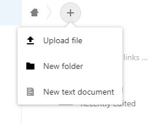

# Files management
Be aware, any files you drop here can be seen by anyone so you may want to only upload to the shared folder when you want to use them and delete them afterwards. You can of course upload them to your personal area. 

!!! note 
    These instuctions apply when accessing the file server on a desktop via the web browser

Once you are logged into NextCloud, you can see a files icon at the top left

Clicking this will reveal your area, this is very similar to what you may see in Google Drive. 
Anything with a symbol like this:

is a shared folder. We’ve tried to name them logically after the machine that they link to. 
Once you select the shared folder it’s the same as uploading to any other folder. 
Press the plus icon to get a menu and select upload file

Pick a file and it uploads to the folder you are currently in.

## Moving a file
To move a file, you can drag and drop, or select the three dots to the right of the row and select a new location. Unfortunately, shared folders don’t show the “shared” icon here so be careful where you move it to. 

