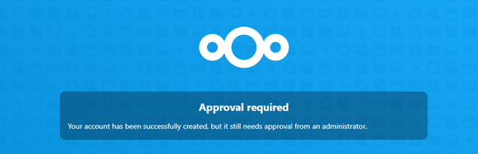

# Registration and Login
##Registration
To register for access to the Create Oldham file server follow the below steps.

1.	Go to files.createoldham.com
2.	You’ll see a login page –  click the register button. 
3.	Put your email in and click verify; you’ll be sent a verification code that you can add on the next screen.
4.	From there follow the steps to create your account
    1.	Ensure you enter your full name so we can match your access to your member record.
    2.	It helps if you use the same email you signed up to us with too (The one you receive members emails on)
5.	You’ll then see a screen like this: all you need to do is wait for one of the team to approve your sign up. This could be up to a couple of days because we’re all volunteers, but if you think we may have missed it you can reach us using systems@createoldham.com or @systems on Discord.

One quick note, your username is always your email address. 

## Login
Once your account has been enabled (you will have an email from one the team) you can login at <https://files.createoldham.com> 

!!! tip ""
    If you are lucky enough for it to be enabled immediately, then you’ll still need to navigate back to this link.

If this is the first time you are logging in, you’ll see a welcome window. You can watch it or close it with the x in the top corner. 
Dropping files to a machine’s shared folder
Be aware, any files you drop here can be seen by anyone so you may want to only upload to the shared folder when you want to use them and delete them afterwards. You can of course upload them to your personal area. 
On desktop
Once you are logged into NextCloud, you can see a files icon at the top left
